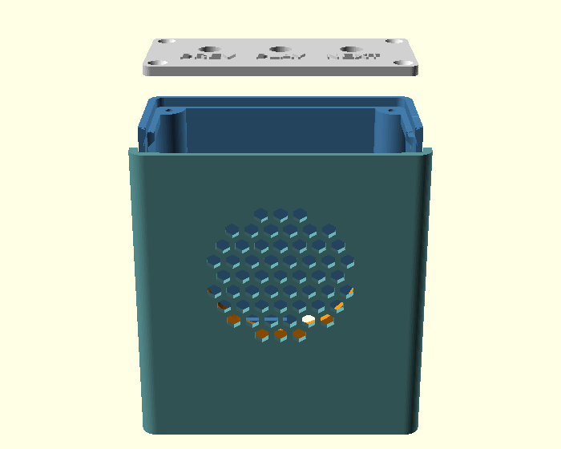
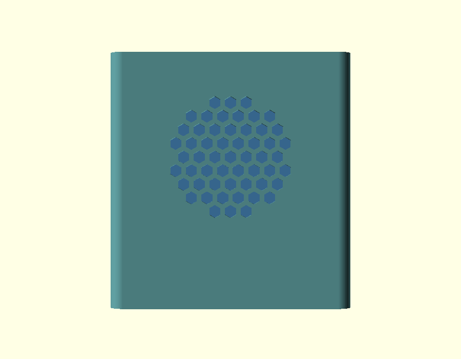
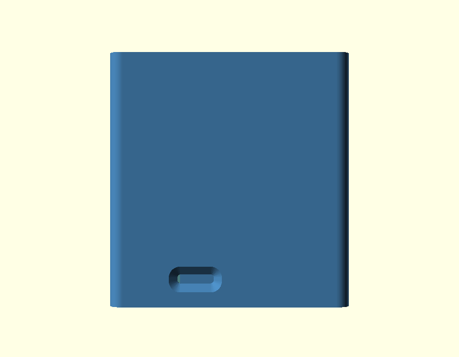
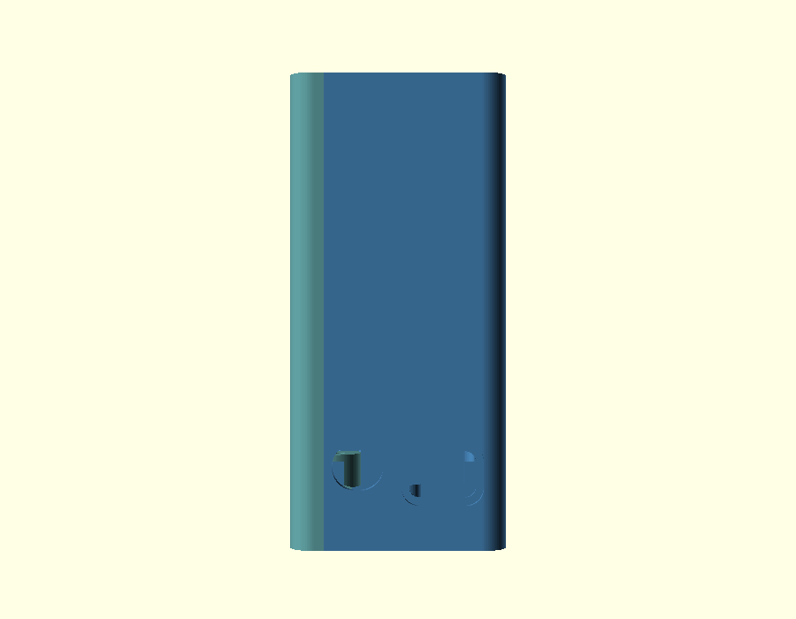
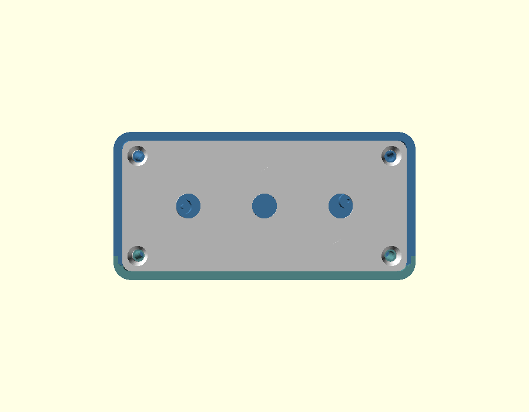
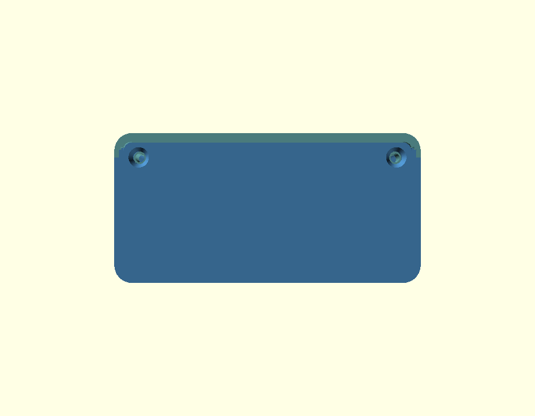
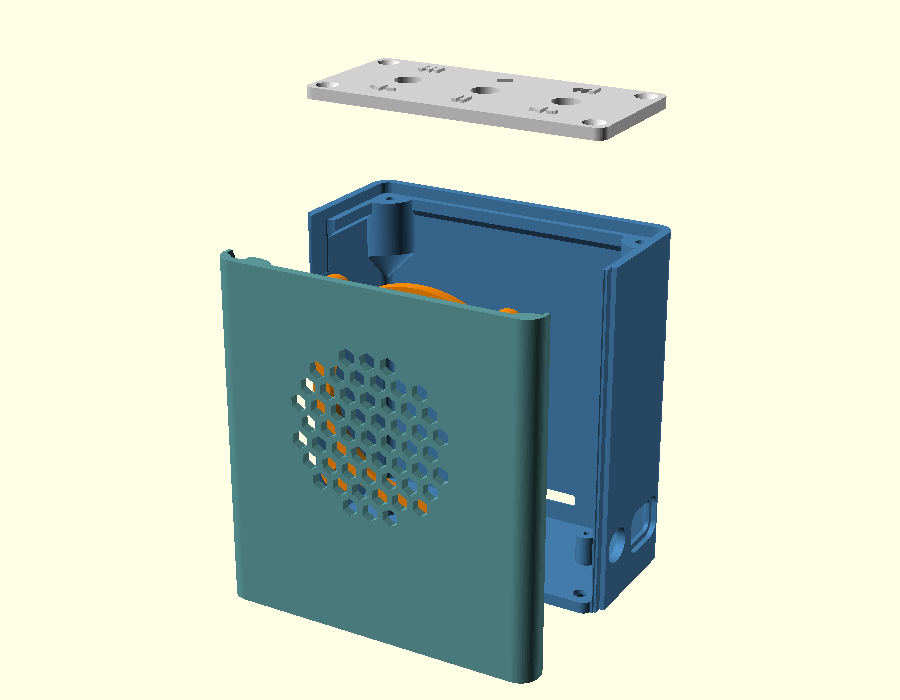

# Personal jukebox enclosure

A printed box for an MP3 module, a 57 mm speaker and three buttons. It has four printed parts.

> **AI wrote this project.** Claude made the OpenSCAD model, the scripts and this README. Measure
> your parts. Compare them to the dimensions in this README before you print.



| | |
| --- | --- |
|  **Front**: the grille |  **Back**: the microSD slot |
|  **Right**: the jack and the micro USB port |  **Left**: no openings |
|  **Top**: the lid and three buttons |  **Bottom**: the floor is part of the body, with two screws |



The box is **86.8 x 42.5 x 91.6 mm**. It stands upright. The speaker points forward.

## Contents

- [Bill of materials](#bill-of-materials)
- [Screws](#screws)
- [Feet](#feet)
- [Print the parts](#print-the-parts)
- [How the box comes apart](#how-the-box-comes-apart)
- [Assemble the box](#assemble-the-box)
- [Wire the buttons](#wire-the-buttons)
- [Use the box](#use-the-box)
- [Change the music later](#change-the-music-later)
- [Put music on the card](#put-music-on-the-card)
- [Build the STL files](#build-the-stl-files)
- [Use different parts](#use-different-parts)
- [Make the renders again](#make-the-renders-again)

## Bill of materials

| Part | Jaycar code | Qty | AUD |
| --- | --- | --- | --- |
| Arduino Compatible MP3 Audio Player | XC3748 | 1 | 17.50 |
| 57 mm All Purpose Replacement Speaker | AS3000 | 1 | 4.95 |
| Red Miniature Pushbutton, SPST momentary | SP0710 | 3 | 6.00 |
| Rubber Feet, small, stick on, pack of 4 | HP0815 | 1 | 2.50 |
| | | | **30.95** |

These prices are the Jaycar list prices in August 2026. The prices change.

You also need a microSD card, a micro USB cable, a 5 V USB charger and 2 m of wire. Use wire of
28 AWG to 30 AWG. You also need approximately 101 g of filament.

## Screws

The model needs 12 screws. The head type is as important as the length. Jaycar does not sell the
correct heads, so buy these screws from a fastener supplier.

| Qty | Size | Head | Use |
| --- | --- | --- | --- |
| 6 | M3 x 10 | countersunk, 90 degrees | 4 in the lid, 2 up through the floor |
| 4 | M3 x 6 | pan | the speaker ring |
| 2 | M2 x 8 | pan | the board |

The lid and the floor have a conical recess at each screw. A countersunk head seats in this recess
approximately 1 mm below the surface. A pan head cannot seat in a cone. A pan head stands
approximately 1.6 mm above the surface. This is a problem at the floor, because a rubber foot goes
over each of the two screws there. A foot cannot stick to a surface that has a screw head above it.

The speaker ring and the board both have a plain hole at each screw. The head must bear on a flat
face, so use a pan head.

All four sizes cut their own thread in the plastic. The holes in the model are the correct pilot
diameters. Screws for plastic hold better than machine screws, but machine screws also work.

## Feet

The bottom of the box is flat. There are no recesses for the feet.

Use four rubber feet, one in each corner. The two at the front go over the two screws that hold the
panel down. The foot is 12 x 12 mm and the screw head is 5.8 mm, so the foot hides the screw. Those
two screw heads must be flush. Refer to the section above.

The feet do two things. They stop the box when it slides. They also separate the box from the bench,
so the bench does not amplify the vibration of the speaker.

The feet do not stop the box when it falls over. The box is 91.6 mm tall and 42.5 mm deep. The
speaker is the heaviest part and its centre is 54 mm above the bench. The box falls over at
approximately 21 degrees from vertical. A pull on a headphone cable is enough. Put the box against a
wall, or add mass inside the box.

## Print the parts

Choose one of two setups. They differ only in the lid.

### Setup one: one colour

```sh
./make-stls.sh one-colour
```

One file, `stl/plate_one_colour.stl`, holding all four parts on a bed of **177 x 143 x 92 mm**. Slice
it and print it. That is the whole job.

### Setup two: two colours

```sh
./make-stls.sh two-colour
```

Two files, printed one after the other.

| Order | File | Bed | Layers | Colour |
| --- | --- | --- | --- | --- |
| 1 | `stl/plate_two_colour.stl` | 156 x 143 x 92 mm | 458 | one colour throughout |
| 2 | `stl/plate_lid.stl` | 82 x 38 x 4 mm | 19 | change filament at **3.0 mm** |

The icons stand 0.8 mm proud of the top of the lid and nothing else on the lid reaches that height,
so one filament change prints all six of them in a second colour. No multi material hardware is
needed. The lid is 3.8 mm tall, its top face is at 3.0 mm, and the icons are the four layers above it
at 0.2 mm.

**This is why the lid gets a bed of its own.** A colour change is a height, not a part. Made at 3.0 mm
on a shared bed it would also land partway up the body, the panel and the ring.

#### Setting the colour change in the slicer

This is a **layer change**, not a property of the STL file. The file cannot carry it, so nothing in
the model will offer it to you. You add it in the slicer, and there are two things to get right
before it appears at all.

1. **Add a second filament first.** In Bambu Studio the filament list is at the top left of the
   Prepare tab. Press the **+** beside the swatches and set the second colour. With only one filament
   in the project there is no colour to change to, so the option is not offered.
2. **Slice, then go to Preview.** The layer slider and its tools live in Preview and do not exist in
   Prepare. This is what most people are missing when they cannot find the setting.
3. **Drag the vertical slider on the right** until the icons first appear in the preview. That
   is the layer to change on. Trust what you see rather than counting: it lands at Z **3.2 mm**, the
   first of the four layers above the 3.0 mm top face.
4. **Click the + on the slider handle**, or right click it, and choose the filament change. Pick
   filament 2. Without an AMS, choose the pause instead and swap the spool by hand when it stops.
5. **Slice again and scrub the slider.** Everything below 3.0 mm should be the first colour and all
   six icons the second. If the icons are the wrong colour you are one layer out.

PrusaSlicer, Orca and Cura all work the same way. The control is on the layer slider in the sliced
preview, and it is variously called add filament change, add colour change or add pause.

Print the lid first. It takes minutes, and it tells you whether the colour change landed on the right
layer before you commit to the 458 layer bed.

**The lid carries icons, not words.** An earlier version set the six labels in type at 3.5 mm and it
did not survive the nozzle: the stems of Liberation Sans work out near 0.34 mm at that size, under
one 0.42 mm extrusion, so the slicer dropped them. Letters came out broken and the plus on volume up
vanished altogether. The icons are drawn as solid triangles and bars instead, and every stroke is
`icon_t`, which is 1.2 mm, or three beads at a 0.4 mm nozzle. Nothing on the lid can now fall under
one extrusion.

They are drawn in the model rather than imported. No font OpenSCAD can reach carries the media
control glyphs, and an icon set drawn on a 24 px screen grid lands back under one extrusion when it
is scaled to 4 mm.

### Either way

Any bed of 200 mm is large enough for both setups.

- **No part needs support material.** The body stands upright on its floor. This is the only
  orientation that puts the rails and posts of the board seat the right way up. The panel lies on its
  face, which puts the grille flat on the bed. The lid and the ring lie flat.
- **The body is the tall part.** It makes its bed 91.6 mm high, and most of those layers hold nothing
  but a thin wall, so they are quick. The volume of plastic is what sets the time, and that is the
  same in both setups.
- **Use 0.2 mm layers and 3 perimeters.** Approximately 101 g in total.

You can also use 0.3 mm layers. No part needs 0.2 mm. The only small vertical detail is the icon
relief of 0.8 mm. At 0.3 mm the tall bed is 306 layers. First set `icon_relief = 0.9`. The icons are
then exactly three layers, and the colour change is still at 3.0 mm.

Three details of the model exist only to keep both setups free of support material. A 45 degree run-up
carries the ledge of the lid, which would otherwise overhang the cavity by 2 mm. A 45 degree cone
sits under each of the two lid posts in the back corners, which would otherwise start in mid air. The
cone is struck from the corner of the box and not from the axis of the post, so every layer of it
touches a wall. Nothing else on the body overhangs by more than 0.25 mm, except the tops of the three
openings in the walls, which bridge across 10 mm to 16 mm.

To get one STL file for each part, use `./make-stls.sh parts`. They are written as `stl/part_*.stl`
and come out in model coordinates rather than print orientation, so lay the panel grille down before
you slice it. They are for reprinting a single part, not for a first build.

| Part | Function | Volume |
| --- | --- | --- |
| `body` | the back wall, the side walls, the floor, the board seat and all the openings | 46.7 cm³ |
| `panel` | the front face, the grille and the speaker mount | 22.7 cm³ |
| `lid` | the top, the buttons and the labels | 8.5 cm³ |
| `speaker_ring` | it clamps the rim of the speaker | 3.4 cm³ |

## How the box comes apart

**The front is a separate part.** The four screws of the speaker ring point to the rear. In a closed
box, no screwdriver can reach them. Put the loose panel face down on the bench. Then you can turn
the screws from above.

**The seam is a half lap.** The two halves do not butt. Down each side seam the body carries the
inner half of the wall on past the seam as a tongue, and the panel has a groove to match. The tongue
is thinner over its last 0.6 mm, so it finds the groove before it has to be square to it. The panel
therefore drops into place and stays there while you drive the screws. From the outside you still see
one line. Across the bottom the floor does the same job a different way: it reaches forward past the
seam, stopping 0.25 mm short of the inside of the panel's front wall, so the wall cannot bow inwards.

**The floor is part of the body.** There is no bottom plate. A box open at the top and the bottom is a
tube open at both ends, and it flexes. Closing one end is what makes it feel solid, and it costs
nothing to look at, because the floor is the one face nobody ever sees. The front, the top and the
body are still separate parts, so all three visible surfaces can still be a different colour.

**The lid takes four screws, the floor takes two.** Each lid screw goes down into a post in a corner.
The two posts at the front are part of the panel, so those two screws pull the panel down. The two
screws in the floor go up from underneath into two more posts at the front, which are also part of the
panel, and pull its bottom in. Six M3 screws in total, where the old bottom plate needed eight.

**The board is bolted to the floor.** Two M2 screws and two short rails hold it. The rails prevent
movement of the board. Take the panel off and the board is in front of you with the whole front of the
box open, so a short screwdriver reaches everything.

## Assemble the box

1. Put the panel face down on the bench. Put the speaker into the collar. The magnet must point up.

2. Put the speaker ring on the rim of the speaker. Install four M3 x 6 screws. The ring clamps the
   rim against the wall. **Do not use a longer screw. A longer screw comes through the front face.**

3. Do the wire work on the board while it is still loose on the bench. It is easier there than in the
   box, and the next steps need the speaker wires already on.

4. Wire the three buttons. Refer to the next section. Install the buttons in the lid. Install the
   nuts on the outside face. The lid is 2 mm thick at each hole, so the thread is long enough.

5. Solder the speaker wires to the S-OUT pair. This pair is at the header end of the board. Make
   these wires 150 mm to 200 mm long.

6. Put the board into the box through the open front. Sit it on the two rails with the jack to the
   right. There is 8.8 mm of slack at the header end, which is more than the 4 mm the jack stands
   proud, so drop the board in clear of the right wall and then slide it right until the jack enters
   its opening. Install two M2 screws. The holes in the board are approximately 3.7 mm, so an M2 head
   can pull through the board. Use a washer, or change `pcb_screw_d` to 2.6 and use an M3 screw.

7. Offer the panel up to the front of the body. The tongue down each side seam finds its groove and
   holds the panel roughly in place on its own. Install two M3 x 10 screws up through the floor from
   underneath. They pull the bottom of the panel in.

8. Put the lid on the ledge. Install four M3 x 10 screws. The two front screws go into the panel
   again and hold its top. **Do not use a longer screw. A longer screw touches the board.**

## Wire the buttons

The board has six tact switches in a grid of 2 x 3. Use the three switches in the right column.
**PRE-** is at the top. **NEXT/+** is in the middle. **PLAY/PAUSE** is at the bottom. Connect each
panel button in parallel with the legs of its switch. Do not remove the switches from the board.
Both switches then operate.

Each switch has four legs but only two terminals. Two legs connect to each terminal. Therefore two
of the four legs are already connected together in the switch.

```
   jack end            header end
        1 o----------o 3        1+2 are one terminal
          |  6x6mm   |          3+4 are the other
        2 o----------o 4        wire 1+4, or 2+3
```

**Connect one wire to each side of the switch. Do not connect two wires to the same side.** Use the
two legs that are diagonally opposite. These two legs are always in different terminals. Two wires on
the same side make a permanent short circuit. The module then reads that button as pressed.

Use a multimeter to check the switch. The two legs on one side show continuity. The two legs across
the body show an open circuit until you press the switch.

**Check for a common ground first.** The YX5200 connects each button input to ground. One side of
every button is probably a common rail. Check the continuity between a leg of PLAY/PAUSE and a leg of
NEXT/+. If they show continuity, you need four wires and not six. Use one common return and three
signal wires.

The pads are small. They are 0.6 mm to 0.9 mm.

- Use wire of 28 AWG to 30 AWG. Thicker wire can break the leg off the pad.
- Tin the leg. Tin the wire. Then solder them together. Do not apply heat for a long time.
- Put hot glue on each joint after you test it. You pull these wires each time you remove the lid.
  You cannot repair a pad that comes off this board.
- The button has two solder tags and no polarity. Connect either wire to either tag.

## Use the box

Plug the micro USB into a 5 V charger. There is no power switch. The module draws almost nothing
until it plays.

| Action | Effect |
| --- | --- |
| Press **Previous** or **Next** | previous track, next track |
| **Hold** **Previous** or **Next** | volume down, volume up |
| Press **Play** | play, or pause |

The volume is the part nobody guesses, so the lid says it. Each of the two outer buttons does two
jobs, and the label above each one is what a press does while the label below it is what a hold does.
The board has no separate volume control that reaches the outside of the box.

## Change the music later

There are three methods. You will use the first method most.

**Use the micro USB port. The box stays closed.** The module gives a computer access to the card
through this port. Connect the cable. Copy the files. Disconnect the cable. The opening has a step.
It is larger and shallower on the outside face, so a cable with a large moulding also seats. Check if
**This port also supplies the power.** A charger powers the box, and a computer powers it and gives
access to the card at the same time. The header pins marked G and V are the 5 V input if you would
rather bring power in some other way, but then you need an opening for the lead, and there is none.

**Use the card slot. The box stays closed.** The slot is in the back wall. It is 13 x 3.2 mm. The
mouth has a taper of 3 mm on all four sides, so a microSD card enters the slot easily. The card stops
4.5 mm inside the opening. Use a fingernail for the last part.

**Take the front off.** Remove the four screws in the lid and lift it off. Remove the two screws in
the floor. The panel then comes forward and the board and the card holder are in front of you. This
method always works.

## Put music on the card

`yt-dlp` downloads the audio. `rsync` copies the files to the card. `rsync` does not copy the Apple
metadata. Keep a folder on the Mac. Make the card a copy of this folder. The card then holds only the
files that you put in the folder.

```sh
brew install yt-dlp ffmpeg
```

`get-music.sh` controls the download. This public domain playlist is an example. It has 84 tracks.

```sh
./get-music.sh -n 'https://www.youtube.com/watch?v=Y0t-RqjMH-A&list=PL4A1446D924B9C895'   # list only
./get-music.sh    'https://www.youtube.com/watch?v=Y0t-RqjMH-A&list=PL4A1446D924B9C895'   # download
```

Use `-i 6` or `-i 1-10` to select playlist positions. Use `-1` to get only the linked video. Use
`-o DIR` to change the destination from `~/Music/mp3card`. Use `-m` to write the title and artist ID3
tags, because YouTube files do not have them. Use `./get-music.sh -h` for the other options.

**You must remove the Apple metadata.** A FAT32 card cannot hold extended attributes. The card
therefore gets a second file with the name `._name` beside each file that has an attribute. A player
reads every file, so it shows these files as silent tracks.

```sh
xattr -cr ~/Music/mp3card              # remove the attributes
rsync -rt --delete --exclude='.DS_Store' --exclude='._*' --exclude='*.part' \
  ~/Music/mp3card/ /Volumes/MP3S/      # copy the files
dot_clean -m /Volumes/MP3S             # remove any file that remains
diskutil eject /Volumes/MP3S
```

`--delete` makes the card an exact copy of the folder. If you remove a track from the folder, the
next copy removes it from the card. The three excludes are files that occur in the folder. The card
does not need them. `rsync` and `dot_clean` both report that they cannot read `.Trashes`. macOS makes
this directory at each mount and protects it. This message is not a fault.

**Do not use `cp`.** It copies every attribute. `cp -X` also copies `com.apple.quarantine`. This
attribute alone makes a second file on the card.

## Build the STL files

You need this section only if you change the model. The `stl/` directory already has the files.

```sh
./make-stls.sh                # one STL file for each of the four parts
./make-stls.sh one-colour     # all four on one bed, in one STL file
./make-stls.sh two-colour     # two beds: everything but the lid, then the lid on its own
./make-stls.sh --help
```

The script first calculates the dimensions and prints them. It stops if an override is not valid. It
also stops at an OpenSCAD warning, or if a part is not manifold. Therefore a part with the status
`ok` is correct. The script writes the output of each render to `stl/logs/`.

The script sends the arguments after the target to openscad:

```sh
./make-stls.sh -D 'pcb_w=77' -D 'pcb_d=33'
./make-stls.sh one-colour -D 'button_icons=["prev","play","next"]' -D 'icon_size=5'
```

Set `OPENSCAD=/path/to/openscad` if the script cannot find openscad. You can also open
`jukebox.scad` in the OpenSCAD application and use the Customizer. It is in the Window menu.

## Use different parts

The shell has no requested size. The size is the size that the contents need. To change the size,
change the contents. Three items control the dimensions.

- **Width.** The board, the jack and the header pins are 79.7 mm in a row.
- **Height.** A speaker of 57 mm needs a panel of 63 mm in both directions. This sets the height of
  the front face. The bay for the electronics adds the rest of the height.
- **Depth.** The front panel controls the depth, and not the board. The panel must hold the speaker
  bosses. It must also stay clear of the jack opening behind it.

| Change | Result |
| --- | --- |
| no change | 86.8 x 42.5 x 91.6 |
| `-D 'pcb_over_right_f=0.015'`, header pins cut flush | 81.1 x 42.5 x 91.6 |
| `-D 'speaker_d=40' -D 'speaker_depth=12'` | 86.8 x 42.5 x 74.6 |
| both of the changes above | 81.1 x 42.5 x 74.6 |
| `-D 'pcb_seat_h=5'`, the board sits lower on the floor | 86.8 x 42.5 x 88.6 |

**Start with the board.** The model uses a bare board of **69 x 32 mm**. The catalogue gives
77 x 33 mm. This is the envelope. It includes the header pins at one end and the jack at the other
end. The model holds each board feature as a fraction of the board outline. Therefore a correction to
`pcb_w` and `pcb_d` also moves the rails, the posts, the card slot and the connector openings.

These are the most useful parameters.

- `pcb_w`, `pcb_d`. The board is 69 x 32 mm. All other dimensions scale from these two.
- `pcb_connectors`. The two openings in the right wall. Each row gives the position along the wall,
  the height above the board, the size, the corner radius and the depth of the outer relief.
- `pcb_seat_h`. The height of the board above the floor. This is also the height of the two posts at
  the front that take the floor screws. Below approximately 5 mm those screws are too short to bite
  and the render gives a warning.
- `pcb_rail_len_f`. The length of each rail as a fraction of the board. It is 0.5. The rails are long
  enough to hold the board and short enough to clear the posts in the corners.
- `speaker_flange_t`. The thickness of the rim, 2.5 mm. If the value is too small, the ring does not
  clamp the rim. If the value is too large, the ring damages the cone.
- `ring_t`. The thickness of the ring, 3 mm. The ring sits on the bosses, so this value sets the
  height of the screw head above the wall. If you change it, change the screw length.
- `button_hole_d`. The diameter of the hole, 7.2 mm. Measure your buttons. The bushing diameter is
  not the same on all buttons of this family.
- `button_icons` and `button_icons_below`. The upper and the lower row of icons, one entry per
  button. The names are `prev`, `play`, `next`, `pause`, `vol_up` and `vol_down`. Both lists must be
  the same length, and the render warns if they are not. An unknown name also warns.
- `icon_size`. The height of an icon, 4 mm. Every icon is exactly this tall, so the row offset is
  exact and nothing overruns it.
- `icon_t`. The thickness of every stroke and bar, 1.2 mm. This is the value that keeps the icons
  printable. Below approximately 0.5 mm a slicer starts dropping features at a 0.4 mm nozzle, so
  there is a wide margin here on purpose. It also sets the neck of the speaker.
- `button_nut_d`. The diameter of the nut. The nut sits on the **outside** face. `button_body_d` is
  the clearance below the lid. The model puts the icon clear of the nut and not clear of the
  hole, because the nut is larger than the hole. A driver on the nut is larger again.
- `floor_t`. The thickness of the floor, 3 mm. The floor is part of the body and closes that end of
  the shell. It also has to swallow a countersunk head, which takes 1.8 mm of it.
- `split_clear`. The distance between the seam and the nearest opening in a wall. No opening is ever
  cut in two. `split_fit` is the clearance where the posts of the panel enter the shell, and also the
  clearance in the half lap of the seam.
- `lip_share`. The share of the wall the tongue of the half lap takes. It is 0.5, so the tongue and
  the strap left on the panel are the same thickness. The render warns below 0.9 mm on either.
  `lip_len` asks for the length of the tongue and the render clamps it, because the panel is shallow
  and `lip_land` of its side wall has to stay whole in front of the groove.
- `sd_flare`. The width of the taper at the card slot. `sd_flare_depth` is its depth. Set
  `sd_flare = 0` for a slot with no taper.

Each render prints the calculated dimensions. Read the console after each change.

```
outer  86.8433 x 42.5 x 91.6 mm
cavity 82.0433 x 37.7 x 85.6 mm
pcb 69 x 32, jack out 3.9537, headers out 6.7896 mm
pcb screw posts at [[-28.0485, -0.4896], [32.1264, 1.6096]] from board centre
sd card sits 4.5 mm inside the back wall
split seam at y -14.35, front panel 6.9 mm deep
seam half lap: tongue 1.075 x 2.75, panel strap 1.075 mm
print plate 176.537 x 142.1 mm
```

## Make the renders again

```sh
./export_png.sh     # preview.png and the six straight views in images/
./export_gif.sh     # the turntable, 36 frames. It needs ffmpeg
```

Both scripts make a full CGAL render. The OpenSCAD preview fills the holes of the grille with the
part behind them. A straight view of the front is then not usable.
